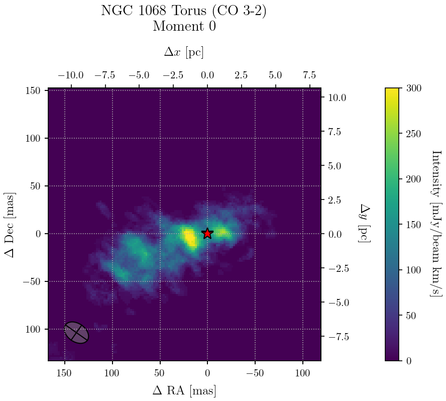

# CubeFig2 - Interactive FITS Cube Viewer

CubeFig2 is a web-based interactive viewer for astronomical FITS data, specifically designed for spectral cubes (e.g., radio astronomy data). It allows users to visualize channel maps, apply masks, calculate moment maps, and export publication-ready figures.

## Features

- **Interactive Cube Navigation**: Scroll through spectral channels with ease.
- **Moment Calculation**: Compute Moment 0 (Intensity), Moment 1 (Velocity Field), and Moment 2 (Velocity Dispersion) on the fly.
- **Masking Support**: fast application and inversion of FITS masks.
- **Physical Axes support**: Visualize data with Physical coordinates (pc/kpc/Mpc) or WCS (RA/Dec).
- **Customizable Plotting**:
    - Toggle Grid, Beam, and Center markers.
    - Adjust Colorbars and Scaling (Min/Max).
    - Dynamic Colormap normalization.
- **Workspace Persistence**: Save your current session (loaded files, views, settings) and restore it later.
- **Publication Export**: Export high-quality plots as PNG, SVG, or PDF.

## Usage

Start the application using:

```bash
python app.py [arguments]
```

### Common Arguments:

- `--file`: Path to FITS file to load initially.
- `--mask`: Path to FITS mask file.
- `--title`: Title for the plot.
- `--show-grid`: Enable grid by default.
- `--show-beam`: Show beam ellipse.
- `--show-physical`: Use physical distance axes.
- `--target-distance`: Distance to object (for physical scale).
- `--offset-unit`: Unit for physical offset (pc, kpc, Mpc).

Example:
```bash
python app.py --file NGC1068_torus_CO32.fits --mask NGC1068_torus_CO32_mask.fits --title "NGC 1068 Torus" --show-physical --target-distance 14.4e6 --offset-unit pc
```

## Gallery


